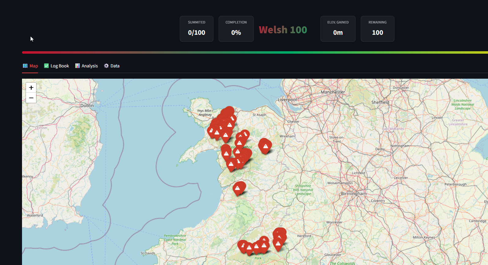
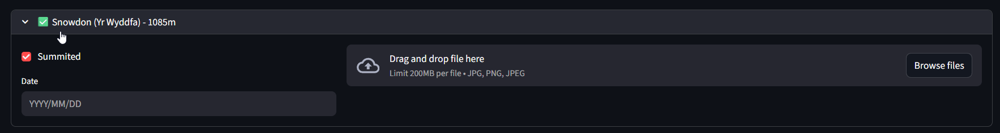
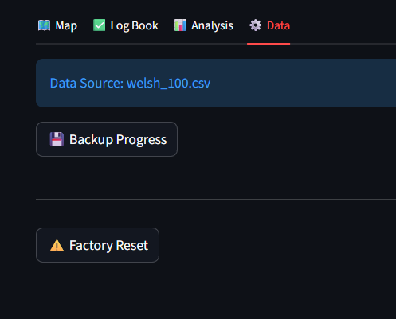
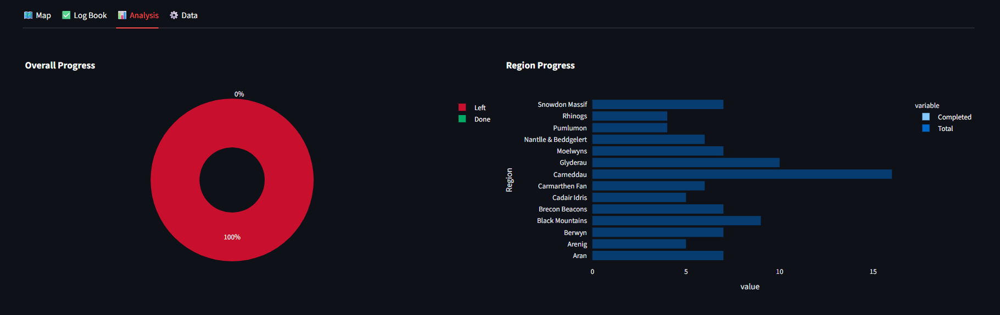

# 🏴󠁧󠁢󠁷󠁬󠁳󠁿 Welsh 100 Tracker

A beautiful, modern web app for tracking your progress on the Welsh 100 mountain challenge—all 100 peaks over 600m/2,000ft in Wales.

  
  
  
  

## ✨ Features

- 🗺️ **Interactive Map** - Visualize all 100 peaks. Markers turn green as you bag them.
- 📊 **Smart Dashboard** - Real-time stats for completion %, elevation gained, and regional breakdowns.
- 📸 **Photo Memory** - Upload summit photos directly to the map popups.
- 🛡️ **Crash-Proof Logic** - Auto-cleans duplicate data and handles "zombie" checkboxes gracefully.
- 🧹 **Auto-Cleaning** - Automatically formats heights and coordinates for perfect sorting.
- ⚠️ **Factory Reset** - Built-in "Panic Button" to wipe progress and clear cache safely.
- 💾 **Persistence** - All data saved automatically to `./data`. Survives restarts!

## 🚀 Quick Start

### 1. Structure
Ensure your folder looks like this:

    welsh100/
    ├── data/                  # Created automatically (stores photos/progress)
    ├── docker-compose.yml
    ├── Dockerfile
    ├── requirements.txt
    ├── welsh100.py
    └── welsh_100.csv

### 2. Run with Docker (Recommended)

Run these commands inside the folder:

    # Build the container (use --no-cache to ensure latest code is used)
    docker compose build --no-cache

    # Start the app in background
    docker compose up -d

The app will be available at: **`http://localhost:8501`**

## 📊 Data Source

This tracker uses a curated list of **100 Peaks**:
- **Source**: Database of British and Irish Hills (DoBIH) / Standard Welsh 100 lists.
- **Criteria**: 600m+ elevation with significant prominence.
- **Correction**: Includes distinct peaks for **Gareg Lwyd** and **Gallt y Wenallt** logic to ensure a perfect 100 count.

## 🛠️ Tech Stack

- **Frontend**: Streamlit
- **Mapping**: Folium & OpenStreetMap
- **Charts**: Plotly Express
- **Data Engine**: Pandas
- **Container**: Docker (Python 3.11 Slim)

## 🐳 Integration (Nginx Proxy Manager)

If running behind a reverse proxy (like NPM):
1.  **Forward Host**: `welsh100` (or container IP)
2.  **Forward Port**: `8501`
3.  **WebSockets**: ✅ Enabled (Required for Streamlit)

## 📝 License

Personal project. Feel free to fork and adapt for your own hiking challenges!
